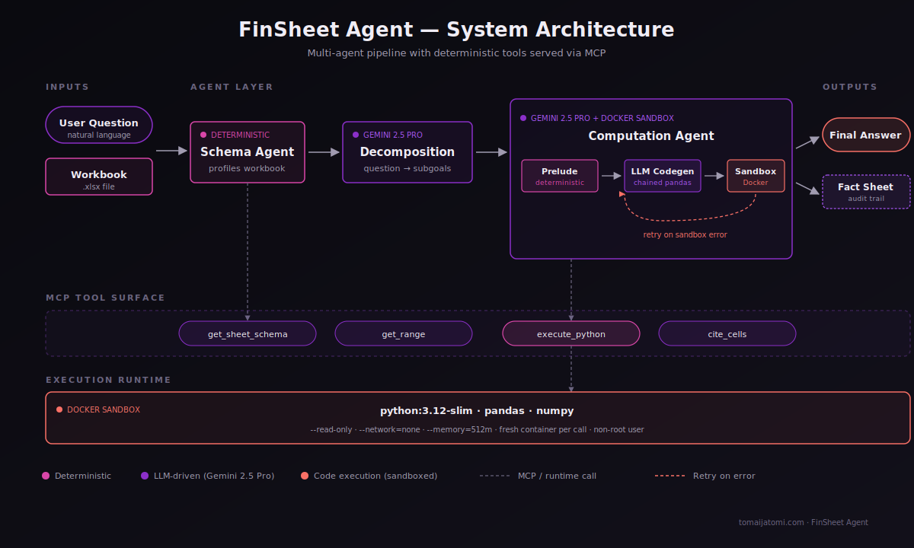

# FinSheet Agent


A multi-agent system for **financial spreadsheet question answering**, applying the **CoDaS (AI Co-Data-Scientist) architectural pattern** (Kim et al., Google Research + DeepMind, April 2026, [arXiv:2604.14615](https://arxiv.org/abs/2604.14615)) to the problem space identified by **FinSheet-Bench** (Ravnik et al., Qubera AG + UZH, March 2026, [arXiv:2603.07316](https://arxiv.org/abs/2603.07316)).

> FinSheet-Bench showed that frontier LLMs (Gemini 2.5 Pro: 82.4% overall, but only 48.6% on the hardest multi-fund spreadsheets) cannot be used unsupervised for financial spreadsheet QA, and explicitly called for *"agentic and pipeline-based approaches that decompose document understanding from numerical computation."* CoDaS demonstrated the design pattern that does this: *"paired deterministic code runners and language model interpreters"*, for biomedical biomarker discovery. This project applies that pattern to FinSheet's problem space, with a **portable MCP-served deterministic-tool surface** as the architectural differentiation from CoDaS.

**Build log:** [Building FinSheet Agent — Part 1](https://tomaijatomi.com/blog/finsheet-agent/) covers the architecture, the partial-eval results, the D18 architectural correction, and the design rationale for the verification layer being built next.

---

## Headline results

On the synthetic FinSheet-Bench analogue (24 workbooks, 528 questions, 16 question templates × 3 difficulty tiers × 2 structural layouts):

| Strategy | Hard tier (synthetic4_A, N=22) | Stratified eval (N=66) |
|---|---|---|
| Naive RAG (M1.4 baseline) | 45.5% | — |
| Full-context Gemini 2.5 Pro (M1.3 baseline) | 81.8% | — |
| **Multi-agent (M2)** | **100%** | **97.0%** |

+18.2 percentage points over the strongest baseline on the hardest file, with the same Gemini 2.5 Pro model. The lift is from the architechture not from a stronger LLM.

Cost: **~$0.012 per question**. Latency: **~76s per question** (mean).

Full 528-question eval is sequenced behind the M2.4 Verification Agent build. See [project status](#status) below.

---

## Architecture



Three agents over a Model Context Protocol (MCP) tool surface, with a Docker sandbox runtime behind `execute_python`:

- **Schema Agent** (deterministic) - profiles the workbook, infers fund layout, collapses multi-line headers, returns a `SchemaCard`.
- **Decomposition Agent** (Gemini 2.5 Pro, structured output) - turns a natural-language question into an ordered `QueryPlan` of subgoals.
- **Computation Agent** (Gemini 2.5 Pro + Docker sandbox) - generates a chained pandas expression covering all subgoals, executes it in a hardened container, returns the value plus a Fact Sheet audit trail.

The full design rationale (and the failure mode that produced the D18 architectural correction) is in [the blog post](https://tomaijatomi.com/blog/finsheet-agent/). The architectural decisions are recorded in [`docs/decisions.md`](docs/decisions.md).

---

## Status

| Milestone | Status |
|---|---|
| M1.1 Stack alive | ✓ scaffold ready; see [`docs/SETUP.md`](docs/SETUP.md) |
| M1.2 Synthetic bench | ✓ **24 files, 528 questions, seed=42 reproducible** |
| M1.3 Baseline #1: full-context Gemini 2.5 Pro | ✓ **94.3% overall, 81.8% hard tier**, $4.06 total |
| M1.4 Baseline #2: naive RAG | ✓ **69.1% overall, 45.5% hard tier**, $2.39 total |
| M2.1 Spreadsheet MCP server | ✓ Five tools + Docker sandbox; see [`docs/M2_1_RUNNING.md`](docs/M2_1_RUNNING.md) |
| M2.2 Schema Agent + Query Decomposition | ✓ Deterministic schema + structured-output decomposition; see [`docs/M2_2_RUNNING.md`](docs/M2_2_RUNNING.md) |
| M2.3 Computation Agent + Fact Sheet | ✓ Single-codegen + retry; **100% hard tier (D18 refactor)**; see [`docs/M2_3_RUNNING.md`](docs/M2_3_RUNNING.md) |
| M2.4 Verification Agent | 🛠 in progress — production safety layer (independent recomputation + confirmed/inconsistent/deferred verdicts) |
| M2.5 Tracing + cost capture | pending |
| M3.\* Full 528-Q eval + Streamlit dashboard + Cloud Run deploy | pending |

---

## Quickstart

```bash
# One-time: install uv (replaces pip/venv/poetry)
curl -LsSf https://astral.sh/uv/install.sh | sh

# Sync deps (creates .venv, installs from uv.lock, ~30s first time)
uv sync --extra dev

# Configure GCP (one-time) — see docs/SETUP.md for the full walkthrough
cp .env.example .env
# fill in .env with your GCP project + region

# Smoke-test Gemini access
uv run python scripts/smoke_test.py

# Build the synthetic bench (deterministic, seed=42)
uv run python -m bench.build

# Build the Docker sandbox image (one-time)
uv run python scripts/build_sandbox_image.py

# Run the test suite
uv run python -m pytest -q
```

---

## Reproduce the results

Every result in the headline table is reproducible from this repo. Each run produces a JSONL of per-question outcomes plus a markdown report; previous runs are committed under `bench/data/results/` and `docs/history/`.

```bash
# Naive RAG baseline (M1.4) — ~$2.39, ~15 min
uv run python scripts/run_baseline.py --strategy naive_rag

# Full-context Gemini 2.5 Pro baseline (M1.3) — ~$4.06, ~17 min
uv run python scripts/run_baseline.py --strategy fullcontext

# Multi-agent (M2.3 hard tier — same 22 questions, single file) — ~$0.19, ~10 min
uv run python scripts/run_baseline.py --strategy agent --files synthetic4_A --concurrency 3

# Multi-agent stratified eval (3 representative files, 66 questions) — ~$0.53, ~11 min
uv run python scripts/run_baseline.py --strategy agent \
  --files synthetic1_A,synthetic4_A,synthetic8_A --concurrency 3
```

Eval runs are **resumable**: re-running the same command picks up where a previous run left off. The report is auto-generated at `docs/eval-report.md` after each run; preserved snapshots are in `docs/history/`.

---

## Repository layout

```
finsheet-agent/
├── bench/                  # synthetic benchmark
│   ├── templates.py        # base file specs
│   ├── generator.py        # canonical DataFrame → xlsx
│   ├── variants.py         # B/C structural variants
│   ├── questions.py        # 16 question templates × 7 categories
│   ├── ground_truth.py     # deterministic GT computation
│   ├── verifier.py         # 3-tier cascading verification
│   ├── build.py            # end-to-end build script
│   └── data/               # generated xlsx + ground_truth.jsonl + results/
├── src/finsheet/
│   ├── agents/             # Schema, Decomposition, Computation, AgentSolver
│   │   ├── schema.py
│   │   ├── decomposition.py
│   │   ├── computation.py
│   │   ├── prelude.py
│   │   ├── agent_solver.py # adapter into the bench runner
│   │   └── types.py        # Pydantic models (SchemaCard, QueryPlan, ...)
│   ├── mcp/                # Spreadsheet MCP server
│   │   ├── server.py       # FastMCP, 5 tools
│   │   ├── workbook.py     # schema inference, range reads
│   │   ├── sandbox.py      # DockerSandbox + LocalSandbox (test only)
│   │   └── runner_image/   # Docker sandbox image
│   └── baselines/          # M1.3 + M1.4 baseline solvers and runner
├── scripts/
│   ├── run_baseline.py     # unified eval runner (--strategy fullcontext|naive_rag|agent)
│   ├── run_question_end_to_end.py
│   ├── start_mcp_server.py
│   ├── build_sandbox_image.py
│   └── smoke_test.py
├── docs/
│   ├── SETUP.md
│   ├── decisions.md        # architectural choices (D1-D18) and rationale
│   ├── M2_1_RUNNING.md     # MCP server runbook
│   ├── M2_2_RUNNING.md     # schema + decomposition agent runbook
│   ├── M2_3_RUNNING.md     # computation agent runbook
│   ├── M2_4_DESIGN.md      # verification agent design
│   ├── PARTIAL_EVAL.md     # partial eval recipe
│   ├── architecture-v4.svg
│   └── history/            # preserved eval reports
├── tests/                  # 109 tests, pytest
├── .github/workflows/      # CI
├── pyproject.toml
└── uv.lock
```

---

## Citations

If you use the synthetic bench or the architectural pattern, please cite both source papers:

```bibtex
@article{ravnik2026finsheet,
  title={FinSheet-Bench: From Simple Lookups to Complex Reasoning, Where LLMs Break on Financial Spreadsheets},
  author={Ravnik, Jan and Li{\v{c}}en, Matja{\v{z}} and B{\"u}hrmann, Felix and Yuan, Bithiah and Stinson, Felix and Singh, Tanvi},
  journal={arXiv preprint arXiv:2603.07316},
  year={2026}
}

@article{kim2026codas,
  title={CoDaS: AI Co-Data-Scientist for Biomarker Discovery via Wearable Sensors},
  author={Kim, Yubin and others},
  journal={arXiv preprint arXiv:2604.14615},
  year={2026}
}
```

---

## License

MIT for code. The synthetic bench data is also MIT-licensed and reproducible from `uv run python -m bench.build` with seed=42.

---

## Author

Built by [Toma Ijatomi](https://tomaijatomi.com) — Senior Data Scientist working at the intersection of GenAI engineering and responsible AI development. [LinkedIn](https://linkedin.com/in/toma-ijatomi/) · [Website](https://tomaijatomi.com/#blog) · [Contact](https://tomaijatomi.com/#contact)
